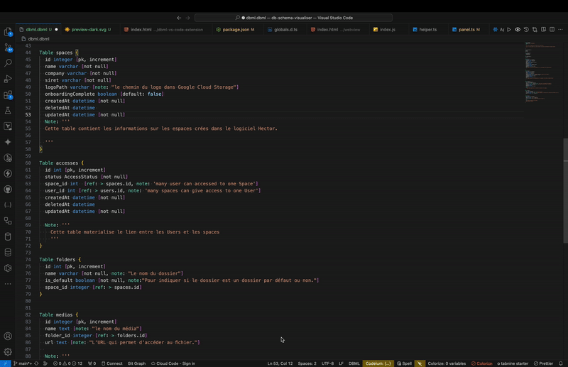

# Database schema visualizer

An Vscode extension to visualize the database schema in ERD from dbml or prisma file in your vscode.

## Demo

## Features

- Create entity relations diagrams from your DBML/Prisma code
- Available in light and dark modes

## How to install and use it

Follow this article: <https://juste.bocovo.me/preview-dbml-code-from-vscode>

## Downloads

- [The DBML extension](https://marketplace.visualstudio.com/items?itemName=bocovo.dbml-erd-visualizer)

## Extensions

- [The DBML extension](./packages/dbml-vs-code-extension/README.md)
- Prisma extension is coming soon

## Contribute

If you want to contribute to this project please read the [contribution note](./CODE_OF_CONDUCT.md)
